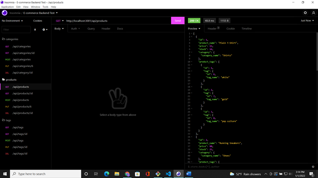
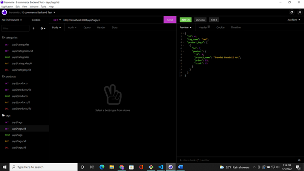
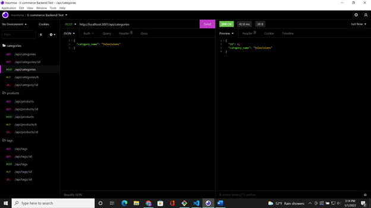
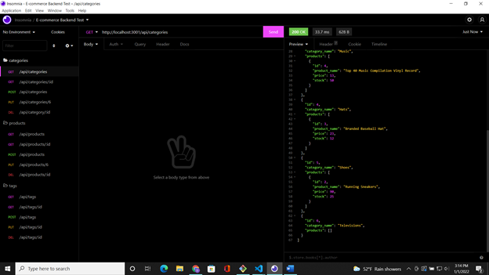

# E-comm-backend 
  ## Description 

  This project is to create a functional backend server for a e-commerce website. It uses mysql and the sequelize package to create, read, update, and delete data from a databases inventory. The future intention is to pair this particular skill set with a front end delopment to create and organize a server and website for a client to sell goods online.

  ## Table of Contents
  In here you will find links to each section of this projects readme
  - [Installation](#installation)
  - [Usage](#usage)
  - [Tests](#tests)
  - [Screenshots](#screenshots/video)
  - [Questions](#questions)

  ## *Installation*

  To install app, download from my repository. Then npm install all dependencies linked in the package.json.(check package versions on npm site to make sure all are up to date.)

  ## Usage 

  Once installed use "npm run seed" to seed database, and use npm start to begin the server. If server doesnt connect you, you should create a .env file and add the password, username associations found in the config folders script file. Link your sql username, password, and the database name found in the db/schema file. Then you should be ready to test app functionality in Insomnia.

  ## Screenshots/Video
  
  
  
  

  - Qucik demonstration video for route usage: [Demo Video](https://watch.screencastify.com/v/WX1mhDsch0zbRiC9hNFN)

  ## Tests

  Use Insomnia, and create routes matching each endpoint listed in the files. 

  ## Questions 

  - My GitHub username: Demsley1
  - Link to my GitHub page and repositories: [Github Link](https://github.com/Demsley1)
  _Link to my main work email if anyone should ever choose to contact me regarding work, or with helpful suggestions on how to improve this project and 
  also fix or update any major issues with project_
  - For All inquires email me at: emsley3684@gmail.com
